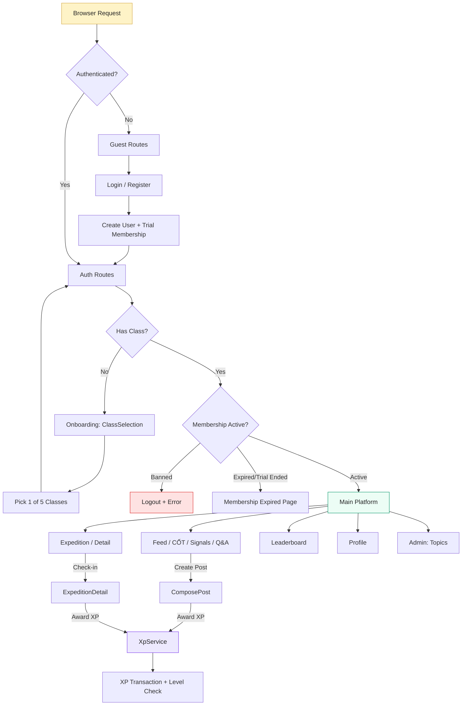
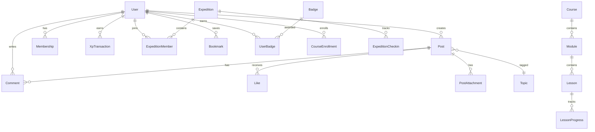
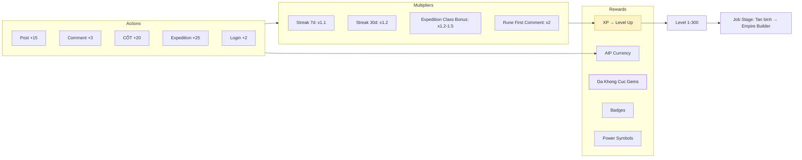
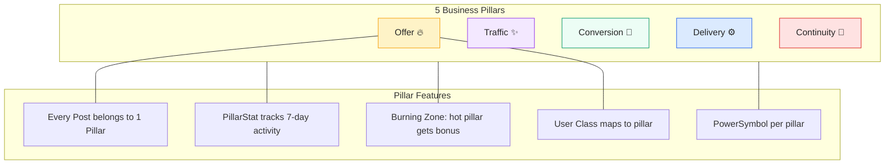

# Visual Explanation: The All In Plan Platform Architecture

## Overview

The All In Plan is a Vietnamese-language community platform for marketers and entrepreneurs. Users learn, post content across 5 business pillars, earn XP, level up through 100+ levels, join group expeditions, and compete on leaderboards. The stack is Laravel 12 + Livewire 3 + Alpine.js + Tailwind CSS v4 with SQLite.

## Quick View (ASCII)

```
┌─────────────────────────────────────────────────────────────────────┐
│                        BROWSER (Client)                             │
│  ┌──────────┐  ┌──────────┐  ┌──────────┐  ┌──────────────────┐   │
│  │ Alpine.js │  │ Livewire │  │ Tailwind │  │  Vite (HMR/Build)│   │
│  │  UI State │  │  WebSocket│  │  CSS v4  │  │  Asset Pipeline  │   │
│  └──────────┘  └──────────┘  └──────────┘  └──────────────────┘   │
└──────────────────────────────┬───────────────────────────────────────┘
                               │ HTTP / Livewire Protocol
┌──────────────────────────────▼───────────────────────────────────────┐
│                        LARAVEL 12 (Server)                           │
│                                                                      │
│  ┌─── Routes (web.php) ──────────────────────────────────────────┐  │
│  │  Guest:  /login  /register  /ref/{username}                   │  │
│  │  Auth:   /onboarding  /logout  /membership/expired            │  │
│  │  Main:   /feed  /cot  /tin-hieu  /hoi-dap  /expedition       │  │
│  │          /leaderboard  /@{username}  /hoc-vien  /affiliate    │  │
│  │  Admin:  /admin/topics                                        │  │
│  └───────────────────────────────────────────────────────────────┘  │
│                               │                                      │
│  ┌─── Middleware ─────────────▼──────────────────────────────────┐  │
│  │  auth → RequireActiveMembership → can('admin')                │  │
│  │         ├─ Check class exists (→ onboarding)                  │  │
│  │         ├─ Check banned status (→ logout)                     │  │
│  │         ├─ Check trial/active expiry (→ expired page)         │  │
│  │         └─ Pass through (→ Livewire component)                │  │
│  └───────────────────────────────────────────────────────────────┘  │
│                               │                                      │
│  ┌─── Livewire Components (21) ─────────────────────────────────┐  │
│  │                                                               │  │
│  │  PAGES          SIDEBAR          AUTH          ADMIN          │  │
│  │  ┌──────────┐   ┌──────────┐   ┌─────────┐   ┌──────────┐  │  │
│  │  │ Feed     │   │ MyXp     │   │ Login   │   │ Topics   │  │  │
│  │  │ PostCard │   │ Leader   │   │ Register│   └──────────┘  │  │
│  │  │ Compose  │   │ Challenge│   │ ClassSel│                  │  │
│  │  │ CotPage  │   │ Expedit. │   └─────────┘                  │  │
│  │  │ Signals  │   │ Burning  │                                 │  │
│  │  │ QaPage   │   │ ClassRat │                                 │  │
│  │  │ Expedit. │   └──────────┘                                 │  │
│  │  │ ExpDetail│                                                │  │
│  │  │ Leader   │                                                │  │
│  │  │ Profile  │                                                │  │
│  │  └──────────┘                                                │  │
│  └───────────────────────────────────────────────────────────────┘  │
│                               │                                      │
│  ┌─── Services ───────────────▼──────────────────────────────────┐  │
│  │  XpService.award(user, type, multiplier, desc, reference)     │  │
│  │  ├─ Base XP: post=15, comment=3, cot=20, expedition=25...    │  │
│  │  ├─ Streak multiplier: 7d=1.1x, 30d=1.2x                    │  │
│  │  └─ Level check: XP thresholds (1-60 table, 61+ exponential) │  │
│  └───────────────────────────────────────────────────────────────┘  │
│                               │                                      │
│  ┌─── Models (29) ────────────▼──────────────────────────────────┐  │
│  │                                                               │  │
│  │  CORE           GAMIFICATION      EXPEDITION     ACADEMY      │  │
│  │  ├─ User        ├─ XpTransaction  ├─ Expedition  ├─ Course   │  │
│  │  ├─ Post        ├─ AipTransaction ├─ ExpMember   ├─ Module   │  │
│  │  ├─ Comment     ├─ DaKhongCuc     ├─ ExpCheckin  ├─ Lesson   │  │
│  │  ├─ Like        ├─ DaKhongCucLog                 ├─ Enroll   │  │
│  │  ├─ Bookmark    ├─ PowerSymbol    COMMUNITY      ├─ Progress │  │
│  │  ├─ Topic       ├─ Badge          ├─ Challenge               │  │
│  │  ├─ Membership  ├─ UserBadge      ├─ PillarStat  OTHER      │  │
│  │  ├─ PostAttach  ├─ LeaderSnap     ├─ AffiliateE  ├─ Setting │  │
│  │  ├─ Question                      ├─ Notification            │  │
│  │  └─ Answer                                                    │  │
│  └───────────────────────────────────────────────────────────────┘  │
│                               │                                      │
└──────────────────────────────▼───────────────────────────────────────┘
                               │
                    ┌──────────▼──────────┐
                    │   SQLite Database    │
                    │  database.sqlite     │
                    │  ~25 tables          │
                    └─────────────────────┘
```

## Detailed Flow

### User Journey & Request Lifecycle



### Data Model Relationships



### XP & Gamification System



### 5 Pillars System



## Key Concepts

1. **Livewire-First Architecture** — No REST API, no SPA. Every page is a Livewire full-page component with server-rendered HTML. Alpine.js handles client-side UI state (dropdowns, timers).

2. **5-Pillar Domain Model** — Every post, course, and class maps to one of 5 business pillars (offer/traffic/conversion/delivery/continuity). This is the fundamental taxonomy of the platform.

3. **XP-Driven Gamification** — XpService is the central business logic hub. All user actions funnel through `award()` which calculates base XP * streak multiplier, logs transactions, and triggers level-up checks.

4. **Membership Gate** — `RequireActiveMembership` middleware is the single checkpoint. All main routes pass through it. It checks: class selected → not banned → membership not expired.

5. **Expedition System** — Group challenges with captains, daily check-ins, class diversity bonuses (5 unique classes = 1.5x XP), and kick mechanics for inactive members.

6. **Content Curation** — Three content tiers: regular posts, Signals (short ≤500 words), and CỐT (curated essentials nominated by level 30+ users).

7. **Rune Mechanic** — Posts can activate a "rune" giving 2x XP to the first commenter within a time window. Creates urgency and engagement.

## Code Example

```php
// XpService — The gamification engine
app(XpService::class)->award(
    $user,                    // Who gets XP
    'expedition_checkin',     // Action type → base 25 XP
    $expedition->getXpBonusMultiplier(), // 1.0-1.5x based on class diversity
    'Check-in: ' . $expedition->title,
    $expedition               // Polymorphic reference for audit trail
);

// Internally:
// 1. Look up base reward: REWARDS['expedition_checkin'] = 25
// 2. Apply streak: user.streak >= 30 ? 1.2x : (>= 7 ? 1.1x : 1.0x)
// 3. Apply multiplier: 25 * 1.2 * 1.5 = 45 XP
// 4. Create XpTransaction record
// 5. Increment user.xp
// 6. Check level-up thresholds
```

## Project Health Summary

```
 Feature Completeness
 ═══════════════════════════════════════════════
 Core (Feed/Post/Comment/Like)     ████████████ 95%
 Auth & Membership                 ██████████░░ 85%
 Expedition System                 ████████░░░░ 70%
 Leaderboard                       ████████░░░░ 70%
 Q&A System                        ████████████ 90%
 Admin (Topics)                    ████████████ 90%
 Academy (Courses)                 ██░░░░░░░░░░ 15%
 Badge System                      ██░░░░░░░░░░ 10%
 Affiliate                         ██░░░░░░░░░░ 10%
 Notifications                     █░░░░░░░░░░░  5%
 ═══════════════════════════════════════════════
 Overall                           ██████░░░░░░ 55%

 Models: 29 total | 8 were empty (now implemented)
 Tests:  0 real tests | Only placeholders
 Stack:  Laravel 12 · Livewire 3 · Tailwind v4 · SQLite
```
